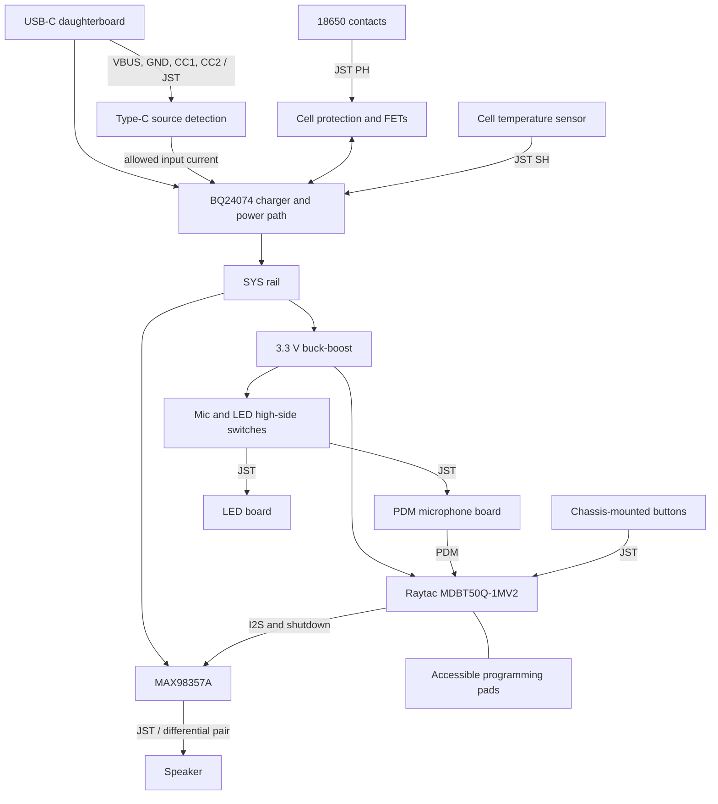

# Chassis-mounted PCB design — 13 September 2026

**Status: proposed electrical architecture and checked mechanical placement study.**
The user selected a castellated nRF52840 radio module. This document specifies
the proposed board and its cable interfaces. It is not a completed schematic,
routed PCB, or fabrication release. `index.circuit.tsx` is still the older,
incompatible circuit sketch; do not manufacture it.

## Assembly

The complete mechanical prototype is now generated by `cad/assembly.py`; see
[`cad/ASSEMBLY.md`](../../cad/ASSEMBLY.md) for the mated connector placement, wire
paths, mounting parts and checks. It enlarges the mic board to 15 × 8 mm and the
LED board to 10 × 8 mm, and adjusts connector locations to fit their plugs. The
older placement study below remains a board allocation reference.

Use one **26 × 126 × 1.6 mm main PCB**, six M2 mounting screws, and a passive
removable cover. Keep the existing 40 × 40 × 150 mm enclosure and diagonal split.
The battery, speaker, microphone board, LED board, USB port and both switches
are retained by the chassis. Opening the cover requires no electrical
disconnection. Cables stay attached to the chassis, away from the joint.

The main PCB carries the soldered radio module, power circuits and speaker
amplifier. Each off-board part plugs into a named JST connector. Buttons are
separate chassis-mounted switches; their actuation forces must not pull on the
main board or its cables. Small microphone and LED daughterboards carry the
surface-mount parts and their own JST sockets. Use pre-crimped leads; soldering
the JST sockets to boards is part of PCB assembly.

### Mechanical coordinates

The current `cad/enclosure.py` is authoritative. Its changes were already in the
working tree and are preserved.

| Item | Constraint |
|---|---|
| Main-board slab | Enclosure X = 9.9…11.5, Y = −13…13, Z = 12…138 mm |
| Circuit coordinates | PCB horizontal coordinate u = enclosure Y; PCB vertical coordinate v = enclosure Z − 75 |
| Component side | Inward, toward decreasing enclosure X |
| Wall-facing side | No components; rests on the existing rails and bosses |
| Holes | Ø2.2 mm, u = ±10 at Z = 16, 38, 97, 115, 134 |
| Installed screws | Six: u = ±10 at Z = 16, 38, 115 |
| Screw allowance | Ø4.5 × 1.8 mm head; 5 mm under-head length gives 3.4 mm engagement through a 1.6 mm board |
| Antenna | Module at u = 0, Z = 130.25, antenna toward Z = 138 |
| RF clearance | Full-width no-copper area Z = 134.2…138 on every layer; additional top-layer notch per module drawing; no screws at Z = 134 |
| Battery | Existing Ø18.6 × 65 mm envelope; center X = −3, Y = 0, Z = 20…85 |
| Battery-side gap | 9.9 − (−3 + 18.6/2) = **3.6 mm nominal** |
| Low components | Allocate ≤3.0 mm inward height beside the cell; actual parts, tolerances and wires must fit within this |

Retain all ten holes so the PCB clears the existing bosses and can be checked
against the exported template. Populate only six with screws. A copper and
component exclusion of at least Ø4.5 mm around every hole reserves screw-head
space. Confirm the actual screws against the pilot diameter and blind depth.
Remove the cell before servicing PCB screws if it obstructs screwdriver access;
this is separate from ordinary cover removal.

The supplied placement drawing shows **group allocations**, not fabricated
footprints. The large battery connector is above the cell. Side-entry signal
connectors keep plugs parallel to the board. The cable must not bend into the
cell-to-board gap or cross the antenna strip.

### Peripheral mounting and wiring

- **Battery:** straps through the existing saddles retain it with the cover off.
  Route insulated terminal leads along the chassis to J_BAT. Select spring
  contacts, positive-contact insulation and reverse-insertion prevention before
  treating this as a usable holder. The CAD carriers are not a validated
  commercial holder. A longer protected 18650 is not assumed to fit.
- **Speaker:** use the existing 20 mm diameter, 4 mm depth envelope, a perimeter
  acoustic gasket and the screw-down retaining bridge in the full assembly. Choose an 8 Ω speaker and start with
  a 1 W playback limit, reduced to its actual rating if lower. Use a twisted
  pair to J_SPK and keep it away from the microphone cable.
- **Microphone:** a 15 × 8 × 1.6 mm custom board fits the existing seat at
  X = 1, Z = 10. Put the bottom-port microphone on the inward face, align its
  PCB sound hole with the enclosure opening, and seal the path with a gasket.
  Include local decoupling and channel-select strapping on this daughterboard.
- **LEDs:** a 10 × 8 × 1.6 mm custom board at X = 8, Z = 140. Place the two
  LEDs 6 mm apart to align with the X = 5 and 11 openings. Put the connector on
  the inward face and retain the board at its perimeter. The full assembly checks the mated socket, plug and
  wire bend. Confirm these envelopes against the ordered connector and leads.
- **Buttons:** separate two-wire normally-open contacts. Mount PTT behind its
  Z = 105 cap and the power/mode switch at Z = 44. The full assembly uses B3F-1000 switches, bonded TPU caps,
  and carrier travel stops. Cap return and adhesive retention need a physical test. No switch footprint belongs on
  the main board.
- **USB-C:** a small chassis-retained daughterboard at Z = 31, with its PCB
  perpendicular to the main board. A conventional right-angle receptacle on
  the main board would face the wrong direction for the X+ wall opening.
  The mechanical prototype uses GCT USB4105 on a custom 6.6 × 13 × 1 mm board;
  verify its manufacturer footprint before fabrication.
  Cable insertion load must go into the chassis. Charging only; programming
  uses the accessible SWD pads.

The full assembly includes proposed USB and button carriers. Its dimensional
checks do not establish their strength, adhesive life or manufactured tolerances.
The earlier main-PCB placement study does not include those parts.

## Connector specification

Use **JST SH, 1.0 mm pitch, side-entry SMT** for signals. Specify the actual
series and part numbers, not generic pin headers. The SH header is 2.9 mm high
and rated 1 A with AWG28 wire. Allow assembly tolerance beyond the body size.
Use a larger **JST PH, 2.0 mm pitch** for the battery so battery and speaker
plugs cannot be interchanged. [JST SH drawing](https://www.jst-mfg.com/product/pdf/eng/eSH.pdf),
[JST PH drawing](https://www.jst-mfg.com/product/pdf/eng/ePH.pdf).

Pin numbers below refer to manufacturer contact numbers. Mark pin 1 and the
connector function on both boards and the harness. Do not infer polarity from
the colors of purchased leads; check continuity before first power-up.

| Ref | Main-board header | Pin order | Destination |
|---|---|---|---|
| J_BAT | B2B-PH-SM4-TB, 2 pins | 1 CELL+, 2 CELL− | Cell contacts, AWG24–26 leads |
| J_USB | SM04B-SRSS-TB, 4 pins | 1 VBUS, 2 GND, 3 CC1, 4 CC2 | Charging-only USB-C board |
| J_MIC | SM04B-SRSS-TB, 4 pins | 1 3V3_MIC, 2 GND, 3 PDM_CLK, 4 PDM_DATA | PDM microphone board |
| J_LED | SM03B-SRSS-TB, 3 pins | 1 3V3_LED, 2 GND, 3 LED_DATA | Two-LED board |
| J_PTT | SM02B-SRSS-TB, 2 pins | 1 BTN_PTT, 2 GND | PTT normally-open switch |
| J_PWR | SM02B-SRSS-TB, 2 pins | 1 BTN_PWR, 2 GND | Power/mode normally-open switch |
| J_SPK | SM02B-SRSS-TB, 2 pins | 1 SPK+, 2 SPK− | Floating speaker coil; neither pin is ground |
| J_NTC | SM02B-SRSS-TB, 2 pins | 1 TS, 2 GND | Electrically insulated cell-temperature sensor |

SH cable housings are SHR-02V-S-B / SHR-03V-S-B / SHR-04V-S-B with
SSH-003T-P0.2-H contacts; PH battery housing is PHR-2 with contacts selected for
the wire gauge. Cable ordering must include a drawing of contact-to-contact
mapping, because cables advertised as “straight” can have different orientation.

J_USB and J_MIC are electrically incompatible despite sharing a connector size;
label and route their captive harnesses to their destinations. The same applies
to the two-pin speaker, button and thermistor connections. These are internal
service connections, not interchangeable accessories.

Start with about 50 mm mic and USB leads, 40 mm button leads, 50 mm speaker and
LED leads, and 100 mm battery/thermistor leads. These are harness allowances,
not cut lengths: determine finished lengths on a printed chassis with plugged-in
connectors. Retain slack on the chassis; never rely on the cover to hold it.

## Electrical architecture



### Radio and programming

Use **Raytac MDBT50Q-1MV2**, 10.5 × 15.5 × 2.05 mm, chip-antenna version.
Follow its normal-voltage reference circuit: regulated 3.3 V to the specified
VDD/VDDH connections, all grounds connected, USB disabled as documented. The
module includes its 32 MHz crystal and Reg1 inductor. Include a 32.768 kHz
crystal and its load capacitors for BLE timing; select those from the module
guide and crystal load specification. The antenna end goes at the board edge,
with the required copper exclusion on every layer. The top mounting holes stay
unpopulated. The module drawing also excludes top copper in a 1.6 × 1.2 mm
notch, u = −2.3…−0.7, Z = 133…134.2; copy the manufacturer's complete pattern
when creating the footprint. The shield and underside pads require stencil/reflow or suitable
hot-air assembly, not just soldering the visible castellations.
[Raytac approval sheet, sections 2 and 8](https://www.raytac.com/tw/download/index.php?index_id=24).

Expose pogo-pad access for VTREF, GND, SWDIO, SWDCLK and RESET. Initial firmware
and recovery use an external SWD programmer. VTREF is a voltage reference, not
a second power supply. USB-C in this design does not flash firmware. Factory
test firmware on the module is not the device application.

### Power

Replace the AMS1117/TP4056 combination with:

- **BQ24074** charger with a separate system power output. This allows a running
  device to share input power without putting system load directly on the
  charge-termination measurement. Start with a 300 mA charge target; use its
  temperature input with a cell-mounted NTC and follow the datasheet network.
  Charge current must reduce when the system uses the available input budget.
  [TI BQ24074](https://www.ti.com/lit/gpn/bq24074).
- **TUSB320LAI** in sink mode to detect source current advertisement. Do not
  add parallel 5.1 kΩ CC pull-downs if using its integrated sink terminations.
  Default the charger to its conservative 100 mA input mode; allow 500 mA only
  after detecting a 1.5 A or 3 A Type-C source. Default-current/legacy sources
  remain slow charging because this charging-only board does not enumerate
  USB data or perform BC1.2 detection. No USB-PD controller is needed for 5 V.
  [TI Type-C controller](https://www.ti.com/product/TUSB320LAI).
- **TPS63031** fixed 3.3 V buck-boost for MCU, mic and LEDs. Follow its reference
  layout, inductor saturation-current requirement and effective capacitor
  values after DC-bias derating. This maintains 3.3 V both above and below the
  cell's mid-discharge voltage. Keep the switching loop compact and away from
  the microphone connector. [TI TPS63031](https://www.ti.com/product/TPS63031).
- **BQ29700-class cell protection plus back-to-back FETs**, selected against
  the purchased cell's limits and maximum system current. CELL− must remain
  separate from system GND across the protection FETs. No USB shield, test pad
  or mounting connection may bypass them. This is overcharge, overdischarge
  and overcurrent protection; reverse cell insertion needs its own mechanical
  prevention or circuit. [TI protection reference board](https://www.ti.com/lit/ug/sluuaz3/sluuaz3.pdf).

Power the amplifier from SYS, with local bulk and ceramic decoupling, rather
than burdening the 3.3 V regulator with speaker pulses. Provide a short, wide
return to the power section. Fit input ESD protection at the USB receptacle.
Do not route charging current through microphone ground wiring.

Use separate high-side switches for the microphone and LED 3.3 V branches,
with pull-downs that default them off. Select a small package that can be
assembled with the available reflow process. Keep ground continuous and prevent
signal-pin back-power when a branch is off: drive LED data and PDM clock low
before removing power, and use defined pull-downs at reset. The old LED
transistor circuit is not reusable.

“Power” is a firmware power/mode button: stop audio, switch off peripherals and
enter system-off sleep, with GPIO wake. It is not a physical battery isolator.
Measure the complete assembly's idle current; the repository's multi-day
battery estimates are not validation of this design.

### Audio and LEDs

Use **Infineon IM69D130** on the microphone daughterboard. It is a
4 × 3 × 1.2 mm digital PDM microphone operating from 1.62–3.60 V. Select the
channel locally and put its bypass capacitor next to the supply pad.
[Infineon datasheet](https://www.infineon.com/assets/row/public/documents/24/49/infineon-im69d130-datasheet-en.pdf).

The reason for changing microphones is electrical: INMP441 requires 64 bit
clocks per stereo frame, while native nRF52840 I²S master mode generates twice
the selected 8/16/24-bit width. PDM capture avoids an additional audio-clock
generator. Keep I²S for playback only. Configure the real capture/playback
rates and resample as needed; nominal “16 kHz” settings do not guarantee exact
16,000 Hz on this MCU. [TDK INMP441](https://invensense.tdk.com/wp-content/uploads/2015/02/INMP441.pdf),
[Nordic I²S specification](https://docs.nordicsemi.com/r/bundle/ps_nrf52840/page/i2s.html).

Retain **MAX98357AETE+**, the 3 × 3 mm TQFN amplifier. Correct its map:
DIN=1, GAIN=2, GND=3/11/15, SD_MODE=4, VDD=7/8, OUTP=9, OUTN=10,
LRCLK=14, BCLK=16; pins 5/6/12/13 are NC. Connect the exposed pad to ground.
Control SD_MODE from the MCU with a reset pull-down for shutdown. Set gain
with a documented resistor option after bench audio testing, and reproduce
mono samples in both playback channels. Do not mark SPK− as a ground pin.
[Analog Devices datasheet, page 15](https://www.analog.com/media/en/technical-documentation/data-sheets/MAX98357A-MAX98357B.pdf).

Use specifically **WS2812B-2020-V6**, with the ordered revision's 3.3 V
operation confirmed. Older WS2812B-2020 parts must not be silently substituted.
Two devices daisy-chain on the LED daughterboard with local bypass capacitors
and a data-line series resistor. The V6 manufacturer notice describes the
3.3 V improvement and 0.6 × VDD input threshold.
[Worldsemi revision notice](https://www.world-semi.com/company-news/587.html).

### Proposed GPIO allocation

These are module-pad assignments for schematic capture, not the old XIAO D-pin
aliases. Fast signals avoid the pads Raytac marks as low-frequency-only.

| Signal | nRF GPIO | Raytac pad |
|---|---|---|
| I²S BCLK | P0.26 | 19 |
| I²S LRCLK | P0.27 | 16 |
| I²S DIN to amp | P0.08 | 24 |
| PDM CLK | P0.06 | 22 |
| PDM DATA | P0.07 | 23 |
| PTT input | P0.02 | 11 |
| Power/mode input | P0.03 | 9 |
| LED data | P0.11 | 27 |
| LED power enable | P0.12 | 29 |
| Mic power enable | P0.13 | 37 |
| Amplifier enable | P0.14 | 36 |
| Charger input mode EN1/EN2 | P1.10 / P1.11 | 3 / 4 |
| Type-C current status OUT1/OUT2 | P1.12 / P1.13 | 5 / 6 |
| Battery ADC, through divider | P0.04 / AIN2 | 20 |
| RESET | P0.18 | 40 |
| SWDIO / SWDCLK | Debug pins | 51 / 53 |
| Low-frequency crystal | P0.00 / P0.01 | 17 / 18 |

Add reset-safe pull-ups for the two button inputs, modest RC filtering and
firmware debounce. The battery divider must remain within ADC pin limits at
maximum cell voltage and have its leakage included in the sleep budget.

## PCB construction and checks

Start with four layers, 1.6 mm total thickness: component/signals, continuous
ground, power/signals, and bottom signals. Keep the antenna area clear on every
layer. The extra ground plane is useful for radio/audio return paths; do not
assume a generic two-layer autoroute preserves them. Use 0603 passives where
practical and actual manufacturer land patterns, including thermal pads.

The checked placement is reproduced with:

```bash
.venv/bin/python hardware/pcb/design.py
.venv/bin/python -m cad.preview output/pcb-design/board-fit.stl
```

Outputs:

- `output/pcb-design/placement.png`: dimensioned component-group placement.
- `output/pcb-design/placement.step`: chassis, cell, board, six screw heads,
  allocated component volumes and peripheral board/speaker envelopes, with the
  cover omitted for inspection. The companion `placement-view.stl` is rotated
  for viewing the open cavity; it is not a printable assembly.
- `output/pcb-design/board-fit.stl`: flat board-only fit coupon with all ten holes.
  Print flat without supports; this tests mounting, not electronic function.

The script imports the current enclosure source and asserts valid board geometry,
board dimensions, hole clearance, allocated-part overlap, screw-head collisions,
cell/shell clearance, and cover removal at six distances. It also runs the
enclosure's existing assembly checks. A passing result is **an envelope check**,
not verification of routing, RF performance, solderability or cable access.

Before fabrication, confirm the modeled USB/switch variants, select cell contacts
and adhesives, and test the printed mounts and harnesses against purchased parts.
Capture the schematic,
import verified footprints, and route the board. Include local-crystal and
load-switch parts in the detailed placement. Run netlist and placement checks,
then routing/DRC, and compare the finished populated PCB against this chassis.
Only that finished circuit should replace `index.circuit.tsx`; regenerate
`circuit.json` before generating assembly drawings. Do not relabel the existing
cached/sketch circuit as this design.

Bench checks should cover charge-current limits, load sharing, cell cutoff,
temperature inhibition, regulator startup, mic capture, amplifier shutdown,
speaker output, both button wake paths and BLE range with the cover fitted.
Print the board coupon and chassis before ordering a populated PCB.
