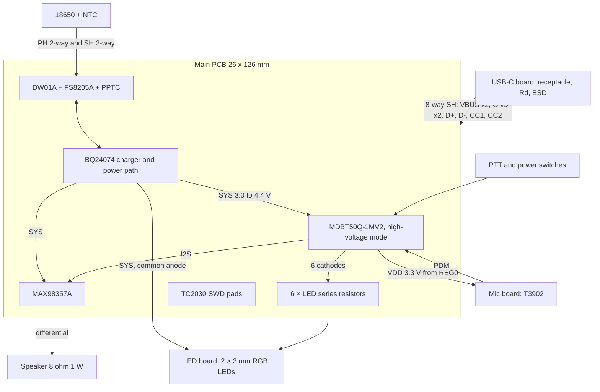

# Devais electrical design — 13 September 2026 (revision 2)

**Status: schematic-level design, not yet captured or routed.** Every part,
net and passive below is specified so the schematic can be entered without
further design decisions. Values marked **verify** were not confirmed from a
primary source; see `docs/research/2026-09-13-*.md` for the verification trail
of everything else. `index.circuit.tsx` is still the old XIAO sketch; do not
manufacture it.

Decisions D1–D8 from the 2026-09-13 session change the previous revision of
this document. D3, D4, D5 and D8 are settled; D1 (harness width), D6 (speaker)
and D7 (assembler) are open and marked where they matter. Where this revision differs from the mechanical assembly in
`cad/ASSEMBLY.md`, the required mechanical updates are listed at the end.

Parts, quantities and sourcing are in [`../BOM.md`](../BOM.md).

## What changed from revision 1

| Item | Revision 1 | Revision 2 | Reason |
|---|---|---|---|
| USB port | Charging only, SWD for firmware | Charging plus USB 2.0 data for DFU and debug; SWD retained for bootloader and recovery | User requirement |
| 3.3 V supply | TPS63031 buck-boost | None. Module runs in high-voltage mode from the system rail; its REG0 output supplies the mic and pull-ups | Both external regulators idle at 25–30 µA; REG0 costs nothing extra and the module's VDD may supply 25 mA |
| Type-C current detection | TUSB320LAI | CC1/CC2 read by the SAADC through the harness | Removes a QFN and gains the same information |
| Battery voltage | Resistor divider on AIN2 | SAADC `VDDHDIV5` internal channel | No divider leakage, no pins |
| Charge current | 300 mA | 1.0 A, input limit 1.2 A on a 1.5 A or 3 A Type-C source | User decision. The safety timer maximum of 9.5 h typical could not cover 300 mA on a 3350 mAh cell either. 1.2 A is the limit of the ready-made USB harness (two 0.7 A contacts on VBUS) |
| Mic power switch | High-side switch | None. Clock held below 200 kHz puts the T3902 in sleep, 20 µA max | Datasheet |
| Microphone | IM69D130 (out of stock) | TDK T3902, PDM, bottom port, Standard mode from 1.0 MHz | Stock; runs at the nRF reset-default 1.032 MHz clock |
| VBUS ESD | ESD441 (DFN0603) | USBLC6-2SC6 only | Hand assembly: DFN0603 is not hand-placeable |
| LEDs | 2 × WS2812B-2020-V6 with data line and power switch | 2 × 3 mm common-anode RGB LEDs, anodes on SYS, six cathodes sunk by GPIO through resistors on the main board | User decision for V1; the V6 and its 3.3 V question drop out |
| Cell protection | BQ29700 class | DW01A + FS8205A, plus 2 A-hold PPTC in the positive lead | Stock, cost, package. Over-discharge threshold 2.4 V is enforced at 3.0 V in firmware |
| Cell thermistor | 10 kΩ, B unspecified | Semitec 103AT-2, 10 kΩ, B = 3435 K | Matches BQ24074 default TS network with no extra resistors |

## Architecture

Rails:

| Net | Source | Range | Loads |
|---|---|---|---|
| VBUS | USB receptacle | 4.35–5.5 V, absent when unplugged | BQ24074 IN, module VBUS pad |
| SYS | BQ24074 OUT | 4.4 V with input present; BAT minus ≤100 mV otherwise (3.0–4.2 V) | Module VDDH, amplifier VDD, LED common anodes |
| VDD | Module REG0 output (pad 28), programmed to 3.3 V | 3.3 V while SYS > 3.6 V, follows SYS minus 0.3 V below that | Mic, button pull-ups, charger status pull-ups, SWD VTREF |
| BAT | BQ24074 BAT pins | 3.0–4.2 V | Cell through PPTC and protection FETs |
| GND | | | Everything except CELL− |
| CELL− | Cell negative terminal | | Protection FET side only; never tied to GND elsewhere |

## Main PCB

### U1 Raytac MDBT50Q-1MV2 (high-voltage mode, REG0 LDO, Raytac section 8.2)

| Pad | Signal | Connection |
|---|---|---|
| 28 VDD | VDD | 10 µF + 100 nF to GND. Output only; nothing else drives it |
| 30 VDDH | SYS | 10 µF + 100 nF to GND |
| 31 DCCH | — | No connection (LDO mode) |
| 32 VBUS | VBUS_MCU | 2.2 Ω 0603 from VBUS (Nordic recommendation), 4.7 µF to GND. Total VBUS capacitance across all boards must stay under 10 µF for USB inrush; the budget is 1 µF (USB board) + 1 µF (charger IN) + 4.7 µF here |
| 34 D− | USB_DM | 0 Ω 0603 to J_USB pin 5. Raytac shows 27 Ω, Nordic states the series resistors are internal; fit 0 Ω, keep the footprint |
| 35 D+ | USB_DP | 0 Ω 0603 to J_USB pin 6. No external pull-up: it is internal and Nordic forbids an external one |
| 17 XL1, 18 XL2 | | 32.768 kHz crystal, 12.5 pF load, 2 × 12 pF C0G to GND (Raytac reference values; confirm against the crystal's CL) |
| 40 P0.18 | nRESET | To SWD pad; 10 kΩ pull-up to VDD, 100 nF to GND. Becomes reset only after UICR PSELRESET is programmed over SWD |
| 51 SWDIO, 53 SWDCLK | | To SWD pads |
| 1, 2, 15, 33, 55 GND | GND | All grounds connected |

Antenna end of the module at the board edge, Z = 138. Copper exclusion on
every layer Z = 134.2…138, plus the top-layer notch from the Raytac drawing.
No mounting screws at Z = 134.

### GPIO allocation

Fast signals are on pads Raytac marks full-speed; DC signals may use
low-frequency pads. All 21 pads below were checked against the Raytac pin
table (Ver. L).

| Signal | nRF | Pad | Direction | External parts |
|---|---|---|---|---|
| I2S BCLK | P0.26 | 19 | out | 33 Ω series at the module |
| I2S LRCLK | P0.27 | 16 | out | 33 Ω series |
| I2S SDOUT (amp DIN) | P0.08 | 24 | out | 33 Ω series |
| PDM CLK | P0.06 | 22 | out | 33 Ω series. Held low when idle: mic enters Clock-Off mode |
| PDM DATA | P0.07 | 23 | in | none on main board (100 Ω on mic board) |
| BTN_PTT | P0.02 | 11 | in, wake | 10 kΩ to VDD, 100 nF to GND at the connector, 1 kΩ series to the pad |
| BTN_PWR | P0.03 | 9 | in, wake | same network |
| LED1_R, LED1_G, LED1_B | P1.01, P1.02, P1.03 | 61, 50, 60 | out, high-drive sink, PWM | 1 kΩ (red) or 560 Ω (green, blue) series to J_LED |
| LED2_R, LED2_G, LED2_B | P1.04, P1.05, P1.06 | 56, 59, 58 | out, high-drive sink, PWM | same |
| AMP_SD_MODE | P0.14 | 36 | out | 620 kΩ 1 % series to MAX98357A SD_MODE |
| CHG_CE | P1.14 | 7 | out | 100 kΩ pull-down. High disables charging |
| CHG_EN1 | P1.10 | 3 | out | 100 kΩ pull-down |
| CHG_EN2 | P1.11 | 4 | out | 100 kΩ pull-down |
| CHG_nCHG | P1.12 | 5 | in | 100 kΩ pull-up to VDD (open drain from charger) |
| CHG_nPGOOD | P1.13 | 6 | in | 100 kΩ pull-up to VDD |
| CC1_SENSE | P0.04 / AIN2 | 20 | analog in | none; 5.1 kΩ Rd is on the USB board |
| CC2_SENSE | P0.05 / AIN3 | 21 | analog in | none |
| VBAT | SAADC VDDHDIV5 | internal | analog | none |
| nRESET | P0.18 | 40 | | see above |

Unused pads are left unconnected. P0.11, P0.12 and P0.13 (pads 27, 29, 37)
are spare full-speed pads; the LED cathodes use low-frequency pads because
PWM at about 1 kHz is well under the 10 kHz limit. Do not route anything to
the QSPI-recommended pads or the NFC pads.

Firmware notes that follow from this table: the Adafruit nRF52 bootloader
board `raytac_mdbt50q_db_40` assigns its DFU button to P0.11 and its LED to
P1.13, which conflicts with CHG_nPGOOD. Fork the board definition with DFU
button = P0.02 (PTT) and the status LED on P1.01 (LED1 red), active low. The bootloader must also program REGOUT0 to 3.3 V; a blank
device outputs 1.8 V on VDD, which is below the LED VIH and the button logic
levels. Check that the forked bootloader does this before relying on USB DFU.

### U2 BQ24074RGTR charger and power path (QFN-16)

| Pin | Name | Connection |
|---|---|---|
| 1 | TS | J_NTC pin 1. Semitec 103AT-2 to VSS through J_NTC; no bias resistors (B = 3435 K matches the datasheet network) |
| 2, 3 | BAT | BAT net, 10 µF to GND |
| 4 | CE | CHG_CE, 100 kΩ pull-down |
| 5 | EN2 | CHG_EN2, 100 kΩ pull-down |
| 6 | EN1 | CHG_EN1, 100 kΩ pull-down |
| 7 | PGOOD | CHG_nPGOOD, 100 kΩ pull-up to VDD |
| 8 | VSS | GND, routed as its own trace to the plane, not only through the pad |
| 9 | CHG | CHG_nCHG, 100 kΩ pull-up to VDD |
| 10, 11 | OUT | SYS net, 22 µF to GND |
| 12 | ILIM | 1.33 kΩ 1 % to VSS: 1.2 A input limit in EN mode (1,0), the harness contact limit |
| 13 | IN | VBUS, 1 µF 25 V to GND (must stay under 10 µF) |
| 14 | TMR | 71.5 kΩ 1 % to VSS: 9.5 h safety timer, the maximum |
| 15 | ITERM | Open: termination at 10 % of charge current |
| 16 | ISET | 890 Ω 1 % to VSS: 1.0 A charge current |
| pad | | GND, at least 8 thermal vias |

Input current limit by EN1/EN2: (0,0) = 100 mA, the reset default because
both GPIOs and both external pull-downs are low; (0,1) = 500 mA; (1,0) = ILIM
resistor, 1.2 A; (1,1) = standby, no charging. Firmware selects 500 mA after
USB enumeration or when a CC pin reads Default, and 1.2 A only when a CC pin
reads 1.5 A or 3 A. With input present OUT is regulated at 4.4 V; charge
current is reduced by DPPM when the system takes the input budget, so on a
500 mA source the cell charges at 500 mA minus system load.

At 1.0 A a 3350 mAh cell charges in about 4 h, inside the 9.5 h timer. On a
500 mA source it takes about 7.5 h, which can exceed the 7.2 h worst-case
timer; firmware then toggles CE to restart the timer when CHG goes inactive
with BAT below 4.1 V. Do not disable the timer.

Dissipation at 1.0 A is 1.4 W with the cell at 3.6 V and up to 2 W at 3.0 V.
The charger's thermal regulation folds charge current back at 125 °C
junction, so the part protects itself, but the case will be warm and the
thermal pad needs its vias and copper. If that proves unacceptable on the
bench, reduce ISET; the layout does not change.

### U3 DW01A + Q3 FS8205A cell protection, F1 PPTC

| Net | Path |
|---|---|
| J_BAT pin 1 (cell +) | F1 PPTC, 2.0 A hold (1812 size; **verify** part, a 1.1 A hold part derates below the 1 A charge current at 50 °C) → BAT net |
| J_BAT pin 2 (cell −) | CELL− net → FS8205A common source pair → GND. The two FETs are drain-connected internally; source 1 to CELL−, source 2 to GND |
| DW01A pin 5 VCC | 100 Ω from BAT, 100 nF to CELL− |
| DW01A pin 6 GND | CELL− |
| DW01A pin 2 CS | 1 kΩ to GND (pack negative side of the FETs) |
| DW01A pin 1 OD | FS8205A gate 1 (discharge FET) |
| DW01A pin 3 OC | FS8205A gate 2 (charge FET) |
| DW01A pin 4 TD | Open |

Thresholds: overcharge 4.30 V, release 4.10 V; over-discharge 2.40 V, release
3.00 V; overcurrent 150 mV across the FET pair, 2.4–3.5 A with FS8205A;
short-circuit 1.2 V. Firmware enforces the usable cutoff at 3.0 V by entering
System OFF; the DW01A is the backstop. CELL− must not connect to GND anywhere
else: no test pad, no mounting hole, no connector shell.

The PPTC and protection do not prevent damage from a reversed cell. Reverse
insertion is prevented mechanically (recessed positive contact, see
mechanical updates).

### U4 MAX98357AETE+ amplifier (TQFN-16)

| Pin | Name | Connection |
|---|---|---|
| 1 | DIN | I2S SDOUT through 33 Ω |
| 2 | GAIN_SLOT | Floating: 9 dB. Two unpopulated 0603 sites, one to GND (12 dB) and one to VDD (6 dB), for bench tuning |
| 3, 11, 15 | GND | GND |
| 4 | SD_MODE | AMP_SD_MODE through 620 kΩ. GPIO high gives about 0.46 V at the pin, the (L+R)/2 mono window 0.16–0.77 V; GPIO low or reset gives shutdown, 0.6 µA typical |
| 5, 6, 12, 13 | NC | Open |
| 7, 8 | VDD | SYS, 22 µF + 100 nF at the pins |
| 9 | OUTP | J_SPK pin 1 |
| 10 | OUTN | J_SPK pin 2 |
| 14 | LRCLK | I2S LRCLK through 33 Ω |
| 16 | BCLK | I2S BCLK through 33 Ω |
| pad | | Ground plane for heat; not internally connected |

The amplifier is filterless; the datasheet specifies no output filter and
shows compliance with 300 mm of unfiltered speaker cable. Use wide output
traces, keep them short, and keep the twisted pair away from the mic harness.
Neither speaker pin is ground. The MCU sends the same sample in both I2S slots.

### LED drive

Six series resistors on the main board, one per cathode: 1 kΩ for red,
560 Ω for green and blue, giving about 2 mA per die at SYS = 4.2 V and less
as the cell drains. The anodes sit on SYS so blue and green keep headroom
down to about 3.3 V; below that they dim, which is acceptable for an
indicator. Configure the six pads as high-drive outputs (9 mA sink) and drive
them high at boot: with the pin at 3.3 V the LED sees at most 1.1 V forward
and stays off. Before firmware runs the pads are inputs; the LED then only
passes leakage-level current into the pad's protection diode, which is
tolerable but is why the boot code sets the outputs first. Brightness by PWM
at about 1 kHz.

### Buttons

J_PTT and J_PWR are two-pin: pin 1 signal, pin 2 GND. Each signal has 10 kΩ
to VDD, 100 nF to GND placed at the connector, then 1 kΩ in series to the
module pad. The RC gives about 1 ms of hardware filtering and the resistor
limits ESD current into the pad; firmware debounces (Omron specifies 5 ms
bounce). Both pins are configured for GPIO sense wake from System OFF. The
10 kΩ pull-up gives 330 µA through the closed contact, below the switch's
1 mA minimum switching current; this is common practice for logic-level
tactile switches and is accepted here.

### SWD

Tag-Connect TC2030-NL footprint on the inward face, accessible with the
cover off: VTREF = VDD, SWDIO, nRESET, SWDCLK, GND, pin 6 unused. First
bootloader flash, UICR programming (REGOUT0, PSELRESET) and recovery use
this. There is no reset button; recovery is SWD, or the bootloader's
double-tap reset and 1200-baud touch over USB, or holding PTT at reset.

### Connectors on the main board

All SH headers are side-entry SMT (2.9 mm tall) so the plugs lie parallel to
the board. Contact numbers are JST's. Mark pin 1 on silkscreen.

| Ref | Header | Pin order | Destination |
|---|---|---|---|
| J_BAT | B2B-PH-SM4-TB, top entry | 1 CELL+, 2 CELL− | Cell contacts |
| J_USB | SM08B-SRSS-TB | 1 VBUS, 2 VBUS, 3 GND, 4 D−, 5 D+, 6 GND, 7 CC1, 8 CC2 | USB-C board |
| J_MIC | SM04B-SRSS-TB | 1 VDD, 2 GND, 3 PDM_CLK, 4 PDM_DATA | Mic board |
| J_LED | SM07B-SRSS-TB | 1 SYS (anodes), 2 LED1_R, 3 LED1_G, 4 LED1_B, 5 LED2_R, 6 LED2_G, 7 LED2_B | LED board |
| J_PTT | SM02B-SRSS-TB | 1 BTN_PTT, 2 GND | PTT switch |
| J_PWR | SM02B-SRSS-TB | 1 BTN_PWR, 2 GND | Power switch |
| J_SPK | SM02B-SRSS-TB | 1 OUTP, 2 OUTN | Speaker |
| J_NTC | SM02B-SRSS-TB | 1 TS, 2 GND | Cell thermistor |

The two-pin harnesses are not interchangeable: a speaker plugged into J_PTT
shorts nothing but a switch plugged into J_SPK shorts the amplifier output.
Label each harness at both ends.

## USB-C daughterboard

About 13 × 10 mm (the receptacle body is 8.94 mm wide), 1.0 mm thick as
modeled, bonded into the printed shoe that carries insertion load.

| Part | Connection |
|---|---|
| J1 GCT USB4105-GF-A-120 | 16-contact USB 2.0 receptacle, 20,000 cycles, through-hole shell stakes. Both VBUS pins to VBUS, both GND pins to GND, both D+ pins tied together, both D− pins tied together, shell to GND, SBU open |
| R1, R2 5.1 kΩ 1 % 0603 | CC1 and CC2 to GND, at the receptacle. 1 % tolerance is required for the current-advertisement thresholds |
| D1 USBLC6-2SC6 | Pin 1 to D+, pin 6 to D+ (through-route), pin 3 and 4 to D−, pin 2 GND, pin 5 VBUS |
| C1 1 µF 25 V 0603 | VBUS to GND |
| J2 SM08B-SRSS-TB | Pin order as J_USB. D+ and D− adjacent; each flanked by a ground or supply |

CC sensing: with Rd = 5.1 kΩ the CC pin reads 0.20–0.66 V for a Default
source, 0.66–1.23 V for 1.5 A, above 1.23 V for 3 A; below 0.20 V is
unattached. Only one of CC1/CC2 is pulled up depending on plug orientation.
The SAADC reads a 5.1 kΩ source at its shortest acquisition time.

## Microphone daughterboard

15 × 8 × 1.6 mm, TDK T3902 (order code MMICT390200012, LGA-5,
3.5 × 2.65 × 0.98 mm) on the inward face with its bottom port over a 0.8 mm
PCB hole aligned with the enclosure opening. Keep paste off the hole.

| Part | Connection |
|---|---|
| U1 T3902 (LGA-5) | 1 DATA, 2 SELECT, 3 GND, 4 CLK, 5 VDD |
| SELECT | GND: right channel, data driven on the falling clock edge; DATA tristates when the clock stops, so enable the nRF PDM DIN pull-down |
| C1 100 nF X7R 0603 | VDD to GND, adjacent to pin 5 |
| R1 100 Ω 0603 | In series with DATA at the mic, to damp ringing. No pull-up or pull-down on DATA |
| J1 SM04B-SRSS-TB | Pin order as J_MIC |

Supply 1.65–3.63 V: powered from VDD, never from SYS. Standard mode with a
1.0–3.3 MHz clock, 500 µA maximum, 64.5 dBA SNR; the nRF reset-default
1.032 MHz with Ratio64 is inside this range, and 1.280 MHz with Ratio80 gives
exactly 16 kHz. Sleep with the clock stopped or below 200 kHz, 20 µA
maximum. Fallback with the same pinout class: MEMSensing MSM261DDB019
(LCSC C51928210), which needs a clock above 1.1 MHz.

## LED daughterboard

About 12 × 8 × 1.6 mm (the 7-position header is 9 mm wide), emitters 6 mm
apart at the `LED_POSITIONS_X` values in `cad/enclosure.py` (X = 0 and 6 in
the current working tree), header on the inward face.

| Part | Connection |
|---|---|
| D1, D2 3 mm common-anode RGB LED, diffused | Anodes to J1 pin 1; cathodes to J1 pins 2–7 in the J_LED order. LED bodies pass through the enclosure holes, which must open to 3.2 mm |
| J1 SM07B-SRSS-TB | Pin order as J_LED |

No resistors or capacitors on this board; the series resistors are on the
main board. Through-hole LEDs are hand-soldered after the panel is assembled,
so this board needs no machine placement at all.

## Harness and lead specification

Signal harnesses are JST SR ready-made IDC cables: 30 AWG, SR plugs on both
ends mating with the SH headers, contacts rated 0.7 A, suffix A = pin 1 to
pin 1. No crimping. The two VBUS contacts in parallel set the 1.2 A input
limit. Battery leads are JST pre-crimped 24 AWG PH leads (1.4 mm
insulation). Centerlines are from the fit report (2026-09-14).

| Harness | Conductors | Centerline | Cable | Use | Terminations |
|---|---|---|---|---|---|
| USB | 8 | 48 mm | A08SR08SR30K102A (102 mm) | whole; fold the excess in the shoe pocket | SR both ends, factory |
| MIC | 4 | 48 mm | A04SR04SR30K152A (152 mm) | whole; coil the excess | SR both ends, factory |
| LED | 7 | 24 mm | A07SR07SR30K102A (102 mm) | whole; coil the excess behind the speaker | SR both ends, factory |
| PWR | 2 | 45 mm | A02SR02SR30K152A halved | 76 mm | SR factory end; solder to switch |
| PTT | 2 | 43 mm | A02SR02SR30K152A halved | 76 mm | SR factory end; solder to switch |
| SPK | 2, twisted | 43 mm | A02SR02SR30K152A halved | 76 mm | SR factory end; solder to speaker pads |
| NTC | 2 | 50 mm | A02SR02SR30K152A halved | 76 mm | SR factory end; solder to thermistor leads, insulate |
| BAT+ | 1 | 24 mm | ASPHSPH24K305 remainder | 65 mm | PH factory end; solder to positive contact tab |
| BAT− | 1 | 124 mm | ASPHSPH24K305 | 165 mm | PH factory end; solder to negative contact tab |

A cut cable cannot be re-terminated with an SR plug (IDC, factory only);
replace it with a fresh half. Voltage drop on the battery pair at 1 A is
under 30 mV. Mark pin 1 with heat-shrink or paint on every plug, and check
continuity against this document before first power.

## PCB construction

Four layers, 1.6 mm: signals and components, continuous ground, power and
signals, bottom signals. No components on the wall-facing side. Passives
0603 minimum everywhere, no DFN or 0402, for hand assembly with a hot
plate and stencil (see `../BOM.md`). Keep the charger, PPTC,
protection and amplifier supply loop compact and near J_BAT; keep the PDM
clock and data away from the amplifier outputs; keep D+/D− as a coupled pair
from the module to J_USB. Antenna keep-out on every layer.

Open item: the MDBT50Q-1MV2 is an LGA module and needs reflow, not an iron.
Hot-plate reflow of the module is the plan; the castellated MinewSemi MS88SF2
is the fallback but ties VBUS to VDDH, which changes the power scheme. The
decision is deferred to the 25-unit run; prototypes use the XIAO nRF52840
Sense (`../PROTOTYPE.md`).

## Bench checks before enclosure assembly

1. SWD: program REGOUT0 = 3.3 V and PSELRESET, flash the forked bootloader,
   confirm VDD = 3.3 V and USB enumeration.
2. Charger: input limit in each EN state, 1.0 A charge, case temperature at
   1.0 A with the cell at 3.2 V, termination, CHG and PGOOD levels, TS fault
   with the thermistor heated and cooled.
3. Protection: over-discharge and overcharge trip with a bench supply in place
   of the cell, PPTC not tripping at 1.2 A.
4. CC sense: ADC readings on a Default port, a 1.5 A and a 3 A charger, in
   both plug orientations.
5. Audio: mic capture with the clock stopped and started, amplifier shutdown
   current, playback into the chosen speaker, no clipping at 9 dB.
6. Sleep: System OFF current of the full board with LED outputs driven high.
7. BLE range and USB DFU with the cover fitted.

## Mechanical updates required by this revision

Implemented in `cad/` on 2026-09-14 (fit report PASS): 8-way USB header and
bundle, 12 × 8 mm LED board with 3.2 mm holes, 72.0 mm cradle with Keystone
5201/5223 carriers and a 1.9 mm reverse-insertion collar around the positive
plate, CMS-2053-18SP cup and bridge. The list below is the requirement as
written before that work.

- USB daughterboard width grows to about 10 mm in the receptacle direction
  and carries an 8-position SH header (10 mm wide). Check the shoe pocket.
- Harness envelopes: 8 conductors in the USB bundle and 7 in the LED bundle;
  battery lead insulation 1.4 mm, not 1.2 mm.
- LED board grows to about 12 × 8 mm; LED holes open from 3.0 to 3.2 mm.
- Battery cradle: inside length 72.0 mm for Keystone 5201 + 5223 contacts
  (currently 71.0), bore at least 19.0 mm (LG MJ1 is 18.65 mm maximum;
  Samsung 35E is 18.55 mm), recessed positive contact for reverse-insertion
  prevention.
- Speaker: if CMS-2053-18SP (5.3 mm deep) is used instead of CMS-2004-18SP
  (4.0 mm), the speaker bridge moves 1.3 mm inward.
- TC2030 pad location on the main board must be reachable with the cover off.
- Mic board outline is unchanged.
